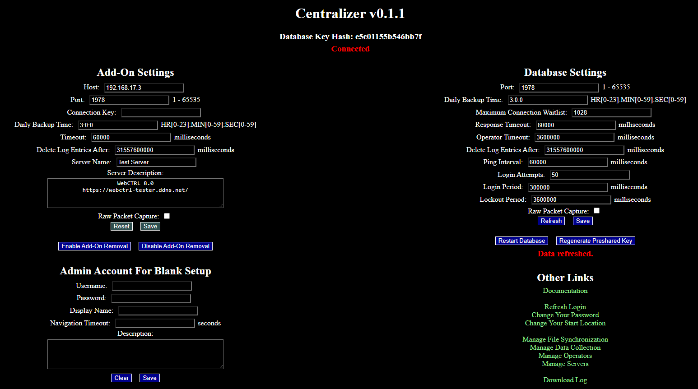
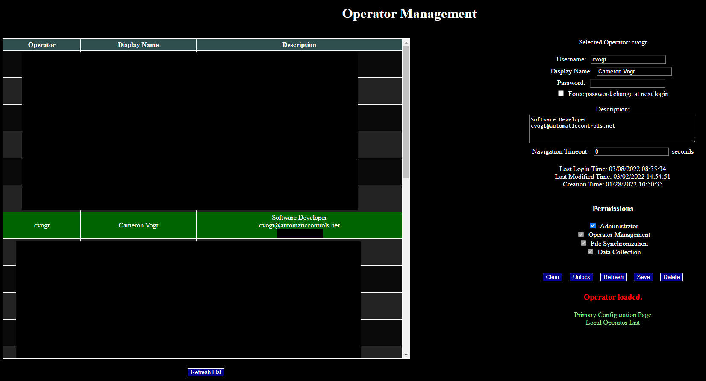
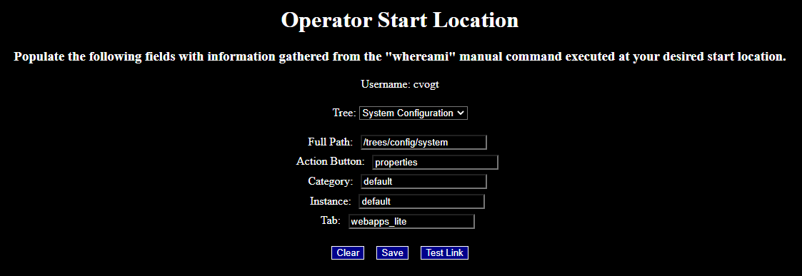
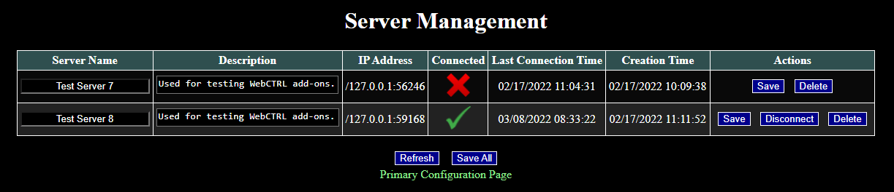
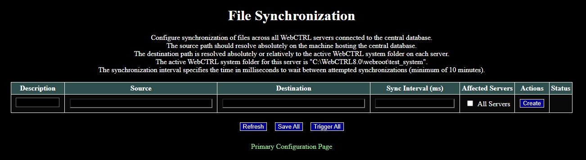
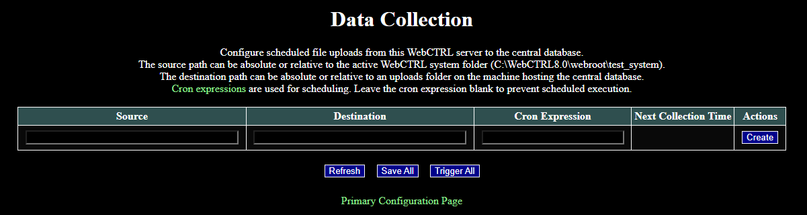

# Centralizer for WebCTRL

WebCTRL is a trademark of Automated Logic Corporation.  Any other trademarks mentioned herein are the property of their respective owners.

## Contents

- [Overview](#overview)
- [Database Installation](#database-installation)
- [Add-On Installation](#add-on-installation)
- [Add-On Uninstallation](#add-on-uninstallation)
- [Database Settings](#database-settings)
- [Database Structure](#database-structure)
- [Operator Management](#operator-management)
- [Server Management](#server-management)
- [File Synchronization](#file-synchronization)
- [Data Collection](#data-collection)

## Overview

Includes a database application that runs as a *Windows* service and a WebCTRL add-on that communicates with the database. The primary function is to synchronize operator credentials and/or files across connected WebCTRL servers. This add-on is intended to be useful for *Automated Logic* dealer branches that maintain hundreds of WebCTRL servers on behalf of clients.

Whenever an employee joins or leaves an *Automated Logic* dealer, the IT guy typically needs to connect to each WebCTRL server individually to update operator lists. Since it could take awhile for the IT guy to get around to every server, there is a security vulnerability that terminated employees could cause problems before their credentials are deleted. It can also be a struggle to change compromised operator passwords or out-dated contact information on every server. There is more tedious work when new versions of add-ons are released and need to be updated on each server.

Centralizer for WebCTRL eliminates all the problems mentioned in the previous paragraph. Operator credentials and contact information can be updated in one place, and specific add-on files can be synchronized across any subset of WebCTRL servers connected to the database. Add-ons will automatically restart on each server when updates are required.

Local operators specific to client WebCTRL servers are unaffected by database synchronization protocols. *Local operators* are defined to be those operators that are managed by WebCTRL in the typical manner. The operators managed by the Centralizer database will be referred to as *central operators*. **The Centralizer add-on does not interfere with local operators.**

Since *Automated Logic* dealer branch employees are assumed to be responsible, all central operators are given local administrative privileges on each WebCTRL server. There is a separate set of [global database privileges](#operator-management) that may be altered among central operators.

Before proceeding, there are some network requirements that must be met. The host computer for the database must be able to accept incoming connections from the IP address of each WebCTRL server. Similarly, each WebCTRL server must be permitted to establish out-bound connections to the database computer's IP address.

All network traffic between the database and each WebCTRL server is securely encrypted using a form of XOR stream cipher with symmetric keys established through RSA encryption. [Forward secrecy](https://en.wikipedia.org/wiki/Forward_secrecy) of each symmetric key is ensured.

## Database Installation

1. Identify a Windows machine you control with nearly 100% uptime. Choose a port to use for network communication (the default is 1978). Ensure port-forwarding is setup on your network firewall to allow inbound connections from all WebCTRL server IPs.

1. Download the latest release of the [database installation files](https://github.com/automatic-controls/centralizer-for-webctrl/releases/latest/download/Database.zip).

1. Unzip and place the installation files into an empty folder in a secure location on your Windows machine.

1. Run *./install.vbs* to install and start the database Windows service on your computer.

1. Run *./stop.vbs* or stop the database service using alternate means. At this point, the application should have generated files under the *./data* directory.

1. Make necessary changes to *./data/config.txt* and restart the database service. During this step, you may change the port to which the database binds. Note that all such manual modifications should take place while the database is inactive (or risk having your changes overwritten). You will want to record the values of *PublicKeyHash* and *ConnectionKey* from this configuration file, since they will be used for configuring the add-on component. To decrease network traffic, you may wish to increase the *PingInterval* to a few minutes.

   | Property | Description |
   | - | - |
   | *PublicKeyHash* | This value should be compared to the hash shown on each add-on's main page. If the hashes do not match, you may be the victim of a [man-in-the-middle cyber attack](https://en.wikipedia.org/wiki/Man-in-the-middle_attack). |
   | *Version* | Specifies the version of the application which generated the data files. On initialization, this value is used to determine compatibility. |
   | *Port* | Specifies the port bound to the database for listening to incoming connections. |
   | *ConnectionKey* | You need this value to connect new WebCTRL servers to the database. |
   | *PacketCapture* | Specifies whether to record encrypted data packets sent over the network in a file *./data/packet_capture.txt*. This should not be enabled for log peroids of time. The primary purpose is debugging.  |
   | *BackupTime* | Specifies the time of day to backup data in RAM to the hard-drive *./data* folder. |
   | *BackLog* | Specifies the maximum number of pending network connections for processing. All incoming connections will be rejected after this limit is surpassed. |
   | *Timeout* | Specifies how long to wait (in milliseconds) for connected WebCTRL servers to respond before assuming the connection has been lost. |
   | *OperatorTimeout* | Specifies how long (in milliseconds) it takes for an operator to be automatically logged off the database due to inactivity. |
   | *PingInterval* | Specifies how often (in milliseconds) that connected WebCTRL servers should attempt to ping the database. |
   | *DeleteLogAfter* | Specifies how long (in milliseconds) to keep historical log records. Logs are recorded in the file *./data/log.txt*. |
   | *LoginAttempts* | Operators are allowed a maximum of *LoginAttempts* failed logins during any period of *LoginTimePeriod*. If exceeded, an operator lockout of *LoginLockoutTime* is incurred. |
   | *LoginTimePeriod* | Specified in milliseconds. See the description for *LoginAttempts*. |
   | *LoginLockoutTime* | Specified in milliseconds. See the description for *LoginAttempts*. |

## Add-On Installation

1. Ensure your WebCTRL server machine can establish outbound connections to the database's IP address and port. Ensure your server is protected with a TLS/SSL certificate (i.e. your server is accessible using the HTTPS protocol as opposed to HTTP). The Centralizer add-on will not function unless these requirements are met.

1. If your WebCTRL server requires signed add-ons, download the [authenticating certificate](https://github.com/automatic-controls/addon-dev-script/blob/main/ACES.cer?raw=true) to the *./addons* directory of your server.

1. Download [Centralizer.addon](https://github.com/automatic-controls/centralizer-for-webctrl/releases/latest/download/Centralizer.addon) and install it on your server using the WebCTRL interface.

1. Navigate to the add-on's main page using the WebCTRL interface.

   

1. Click the **Activate Authentication Provider** button.

1. If your Centralizer database has never connected to a WebCTRL server before, you must fill out the section titled **Admin Account For Blank Setup** and press **Save**. An operator will be created with the configured credentials when the initial connection is established. See [Operator Management](#operator-management) for a description of each property.

1. Fill out the section titled **Add-On Settings**. Press **Save** when all fields are populated.

   | Property | Description |
   | - | - |
   | *Host* | Specifies the IP address of the database to connect to. |
   | *Port* | Specifies the port to use for communications to the database. |
   | *Connection Key* | Specifies the *ConnectionKey* parameter required for establishing an initial connection to the database. This value should be retrieved from the database configuration file. |
   | *Daily Backup Time* | Specifies the daily time of backups where data in the add-on's RAM is written to hard-drive memory. |
   | *Timeout* | Specifies how long to wait (in milliseconds) for the database to respond before assuming the connection has been lost. |
   | *Delete Log Entries After* | Specifies how long (in milliseconds) to keep historical log records. The **Download Log** button on the main page can be used to download these logs, or you can find logs in the private data folder for this add-on. |
   | *Server Name* | Used to identify this server. |
   | *Server Description* | Contains descriptive information for this server, such as the VPN used for establishing connections. |
   | *Raw Packet Capture* | Specifies whether to record encrypted data packets sent over the network in a file *./packet_capture.txt* under this add-on's private data folder. This should not be enabled for log peroids of time. The primary purpose is debugging. |

1. Wait a few seconds and verify that a connection between your WebCTRL server and database has been successfully established. The red status message at the top of the main page should say: *Connected*.

1. Compare the *Database Key Hash* displayed on the add-on's main page to the corresponding *PublicKeyHash* value stored in the database configuration file. If the hashes do not match, you may be the victim of a [man-in-the-middle cyber attack](https://en.wikipedia.org/wiki/Man-in-the-middle_attack).

1. Restart your WebCTRL server using the *rebootserver* manual command.

1. The minimal setup requirements have been completed at this point. To verify, login using valid credentials for a central operator.

## Add-On Uninstallation

1. Click the **Enable Add-On Removal** button located on the add-on's main page.

1. Navigate to the server management page for this add-on and delete your WebCTRL server from the database.

1. Refresh the add-on list page in the WebCTRL GUI, and then remove the add-on as you would normally remove any add-on.

## Database Settings

Most of these settings can be configured from the right side of the main configuration page for the add-on when connected to the database. See the [Database Installation](#database-installation) section for a description of each setting. The **Restart Database** buttons requests that the database reboots. The **Regenerate Preshared Key** button tells the database to generate a new private-public RSA key pair used for the initial handshake when establishing a new connection to a WebCTRL server. Some changes are not applied until after rebooting the database. For instance, changes to the bound port number are not immediately enforced.

## Database Structure

This section describes possible files stored under the *./data* directory of the database instllation folder. Note that all manual changes to these files should be made while the database is inactive (or risk having your changes overwritten).

| File | Description |
| - | - |
| *./Operators/\*\** | Contains data files for each central operator labelled by username. |
| *./Servers/\*\** | Contains data files for each WebCTRL server labelled by name. |
| *./uploads/\*\** | This is the default destination folder for all data collection upload tasks from each WebCTRL server. |
| *./config.txt* | Contains various configuration properties for the database. |
| *./log.txt* | Contains historical log entries for the database. |
| *./packet_capture.txt* | When enabled, this file contains Base64-encoded network data packets. |
| *./keys* | This file contains public and private RSA keys used for the initial handshake protocol when establishing a connection to a WebCTRL server. |
| *./lock* | This file is used to ensure there are never two instances of the database running at the same time. |
| *./file_synchronization* | This file contains data related to file synchronization tasks. |

## Operator Management

Since operator passwords are hashed and salted, there is no effective way to recover a forgotten password. Central operator logins will continue to function even if a WebCTRL server is temporarily disconnected from the database because each server maintains a local copy of operator data files. Each central operator is given local administrative privileges over each WebCTRL server; however, there is a separate set of global database privileges that may be configured or restricted.

| Permission | Description |
| - | - |
| *Administrator* | Gives an operator complete control over the database. |
| *Operator Management* | Permits an operator to manage central operators (e.g, creating, deleting, or modifying operators with permissions less than or equal to the given operator). |
| *File Synchronization* | Gives an operator control over file synchronization tasks (i.e. sending files from the database to each WebCTRL server). |
| *Data Collection* | Gives an operator control over data collection tasks (i.e. sending files from each WebCTRL server to the database). |

There is a link on the add-on's main page to the operator management page. There is also a WebCTRL menu option labelled **Central Operators**. The following information is an example of what the operator management page looks like. Note that irrelevant information has been blacked out.

Click on an operator from the table on the left to view/modify properties of that operator. The **Clear** button deselects the selected operator. To create new operators, click the **Clear** button, fill out all the required fields, and click the **Save** button. If the selected operator has been locked out due to excessive failed login attempts, the **Unlock** button may be used.

| Property | Description |
| - | - |
| *Username* | Specifies the login name of the operator. |
| *Display Name* | Specifies a user-friendly display name for the operator.. |
| *Password* | Specifies the login password of the operator. |
| *Force password change at next login* | Specifies whether to prompt an operator to change their password when they login. |
| *Description* | This field provides descriptive information about the operator, such as a job title or contact information. |
| *Navigation Timeout* | This value controls when WebCTRL servers should automatically logoff this operator after a period of inactivity. Positive numbers specify the seconds to wait until automatic logoff. Negative numbers indicate that the server-specific system-wide timeout should be used (usually 30 minutes). Zero indicates that automatic logoff should not be used. |

Changes to the central operator list are automatically propagated to connected WebCTRL servers whenever they ping the database, which is one consideration for choosing an appropriate database *PingInterval*.

Since local operators cannot be managed while logged in as a central operator, it is necessary to maintain a generic local operator associated to the *Automated Logic* dealer branch as a whole. It is also necessary to maintain a generic local operator because central operator credentials cannot be used for logging into SiteBuilder.

Should that generic account ever be accidentally deleted, there is a workaround that allows any central operator with database administrative privileges to hijack any local operator. To see a list of local operators, click the **Local Operator List** button from the operator management page. Suppose I have credentials for a central operator with username *cvogt*, and I want to hijack a local operator with username *fred*. Then I would login to WebCTRL with the username *cvogt(fred)* and my usual password.

Internally, central operator logins are registered in two places: the WebCTRL server and the database. Sometimes, central operator logins will expire on the database before expiring on the server. Such expired logins do not affect normal server operations; however, you will not be able to make any changes to the database while your login is expired. In this case, you should use the *Refresh Login* button on the main add-on page.

The **Change Your Password** and **Change Your Start Location** buttons on the main add-on page are self-explanatory. The only atypical step is that you must use the *whereami* manual command to gather required information for changing your start location. The following images shows an example which sets the start location to the add-on list configuration page.

## Server Management

The server management page is accessible from the main add-on page. The primary function is to view all WebCTRL servers registered with the database to see whether they are online. You can also change the server name and description for any registered server. The following example shows my WebCTRL7.0 and WebCTRL8.0 test servers.

## File Synchronization

The file synchronization management page is accessible from the main add-on page. Synchronization tasks configured here are one-way. Changes to the source directory on the database propagate to the destination directory on all WebCTRL servers. Changes to the destination directory on each WebCTRL server are overwritten whenever the next sync occurs. Synchronization can either be configured to occur for all servers, or only a specified subset.

It it not recommended to synchronize large files (on the order of 1 GB) because the encrypted data transfer moves rather slowly (2-3 MB/sec). Slow data transfers can block the server-database connection for an extended period of time, thus preventing operators from logging in or making other database changes.

This feature can be used to synchronzie add-on files between all servers. Add-ons are automatically disabled and then re-enabled after updates occur. If I wanted to push [GeoTreeExportXML.addon](https://github.com/automatic-controls/geo-xml-export-addon) out to all servers, the destination path should be *../../addons/GeoTreeExportXML.addon*. Destination paths are resolved relatively to each WebCTRL system folder. Note that two periods in a relative path element jump to the parent folder.

File transfers behave similarly to the command prompt instruction [`ROBOCOPY /S /PURGE`](https://docs.microsoft.com/en-us/windows-server/administration/windows-commands/robocopy). Empty folders are ignored when transferring files. Existing files and/or folders are removed from the destination directory if they are not present in the source. The last modified timestamp for each file is compared to determine whether existing files need to be overwritten.

## Data Collection

The data collection page is accessible from the main add-on page. Data collection tasks are specific to each WebCTRL server and may be used to upload files to the database at regularly scheduled intervals. As with file synchronization tasks, data collection transfers behave similarly to the command prompt instruction [`ROBOCOPY /S /PURGE`](https://docs.microsoft.com/en-us/windows-server/administration/windows-commands/robocopy).

It is not recommended to transfer large files (on the order of 1 GB). If necessary, large file transfers can be scheduled to occur in the middle of the night when no one else is online. [Cron expressions](https://docs.spring.io/spring-framework/docs/current/javadoc-api/org/springframework/scheduling/support/CronExpression.html#parse-java.lang.String-) are used for scheduling purposes. For example, `0 0 1 * * *` is a cron expression which specifies to collect data every night at 1:00AM. The *Next Collection Time* field can be used to verify that a cron expression is working as intended. For security purposes, the destination path is not permitted to overwrite any core database files.